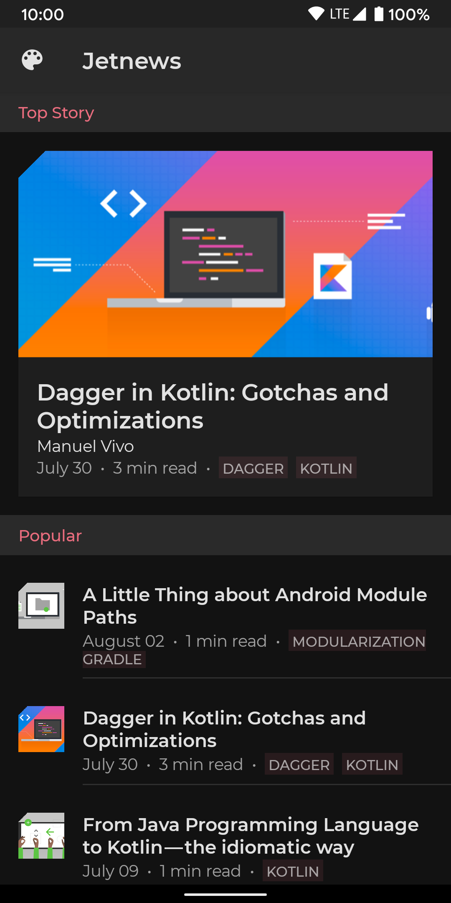

# Jetpack Compose Theming Code-lab

A Material Theme comprises 
- color, 
- typography and 
- shape attributes. 
Customizing these will be automatically reflected in the components you use to build your app.

## Choosing Colors
- Primary is your **main brand color** and 
- AppBar uses primary color and the **screen background is surface**; changing the theme colors is reflected in these composables:
- secondary is used to provide accents(The accent color is used more subtly throughout the app, to call attention to key elements. 
The resulting juxtaposition of a tamer primary color and a brighter accent, gives apps a bold, colorful look without overwhelming the app's actual content.). 
You can supply darker/lighter variants for contrasting areas. 
- Background and surface colors are used for containers holding components which notionally live on a "surface" in your application. 
- Material also defines "on" colors—colors to use for content on top of one of the named colors e.g. text in a ‘surface' colored container should be colored ‘on surface'. 
- Material components are configured to use these theme colors, for example by default a Floating Action Button is colored secondary, Cards default to surface etc.
- Hard coded colors don't respond to theme changes :(

- By defining named colors, it becomes possible to provide alternate color palettes such as both a light and a dark theme.
- It also encourages you to define a small palette of colors and use them consistently throughout your app. 
- [The Material color tool](https://material.io/resources/color/) can help to pick colors and create a color palette, even ensuring that the combinations are accessible.
- When defining colors, we name them "literally", based on the color value, rather than "semantically" e.g. Red500 not primary. 
- This enables us to define multiple themes e.g. another color might be considered primary in dark theme or on a differently styled screen.

## Typography
- While you may not vary type styles by theme, using a type scale will promote consistency within your application. 
- Supplying your own fonts and other type customizations will be reflected in Material components you use in your app e.g. App Bars use h6 style by default, Buttons use, err, button. 
- The Material [type scale generator](https://material.io/design/typography/the-type-system.html#type-scale) tool can help you to build your type scale.
- attributes
  - Scale category[H1-H6, subtitle 1 and 2, body 1 and 2, button, caption and overline]
  - Typeface[fonts; roboto by default]
  - Weight[light, medium, regular etc]
  - Size
  - case
  - Letter spacing

## Shape
- Material supports using shapes systematically to convey your brand. 
- It defines 3 categories: 
  - small, 
  - medium and 
  - large components; 
each of which can define a shape to use, customizing the corner style (cut or rounded) and size. 
  - Customizing your shape theme will be reflected across numerous components 
    - e.g. Buttons & Text Fields use the small shape theme, 
    - Cards and Dialogs use medium and 
    - Sheets use the large shape theme by default. 
  - There is a complete mapping of components to shape themes [here](https://material.io/design/shape/applying-shape-to-ui.html#shape-scheme). 
  - The [Material shape customization tool](https://material.io/design/shape/about-shape.html#shape-customization-tool) can help you generate a shape theme

## Baseline
Material defaults to a 
- "baseline" theme, that is the **purple color** scheme,
- **Roboto** type scale and 
- slightly **rounded** shapes. 
If you do not specify or customize your theme then components will use the baseline theme.


This folder contains the source code for the [Jetpack Compose Theming codelab](https://developer.android.com/codelabs/jetpack-compose-theming).

In this codelab you will learn how to use [Jetpack Compose](https://developer.android.com/jetpack/compose)’s theming APIs to style your application. We’ll see how to customize colors, shapes and typography so that they’re used consistently throughout your application, supporting multiple themes such as light & dark theme.

## Screenshots




## License

```
Copyright 2020 The Android Open Source Project

Licensed under the Apache License, Version 2.0 (the "License");
you may not use this file except in compliance with the License.
You may obtain a copy of the License at

    https://www.apache.org/licenses/LICENSE-2.0

Unless required by applicable law or agreed to in writing, software
distributed under the License is distributed on an "AS IS" BASIS,
WITHOUT WARRANTIES OR CONDITIONS OF ANY KIND, either express or implied.
See the License for the specific language governing permissions and
limitations under the License.
```
